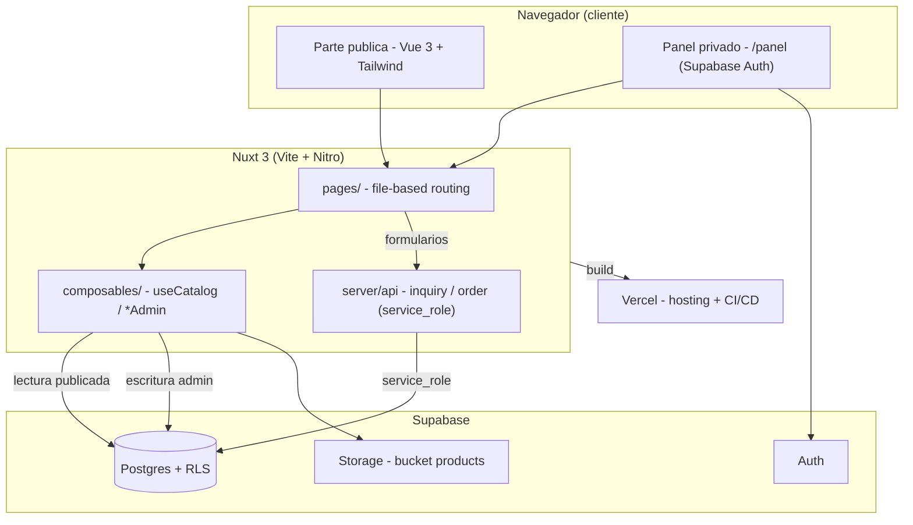
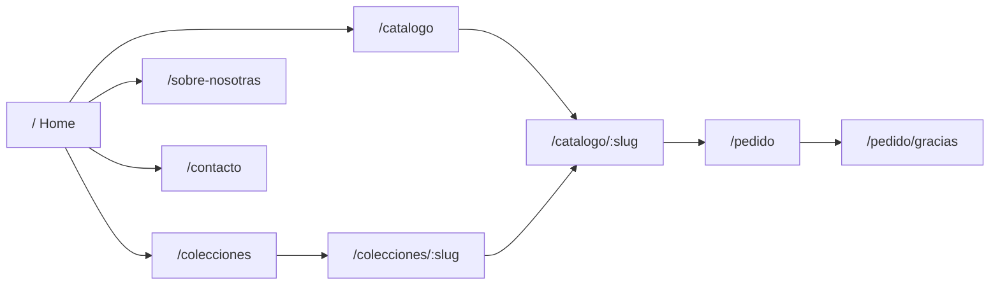
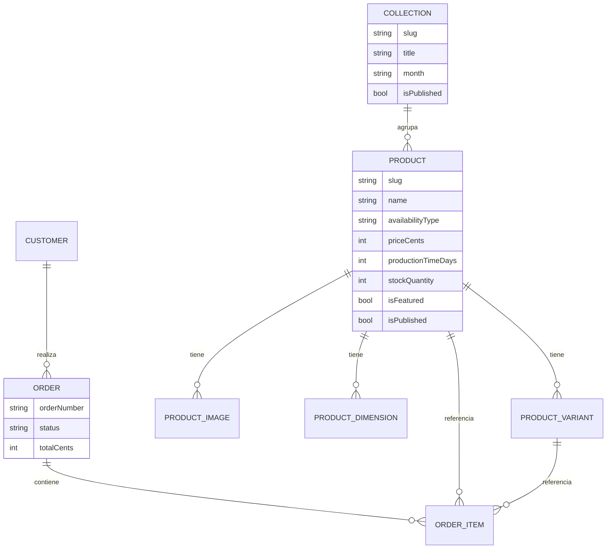
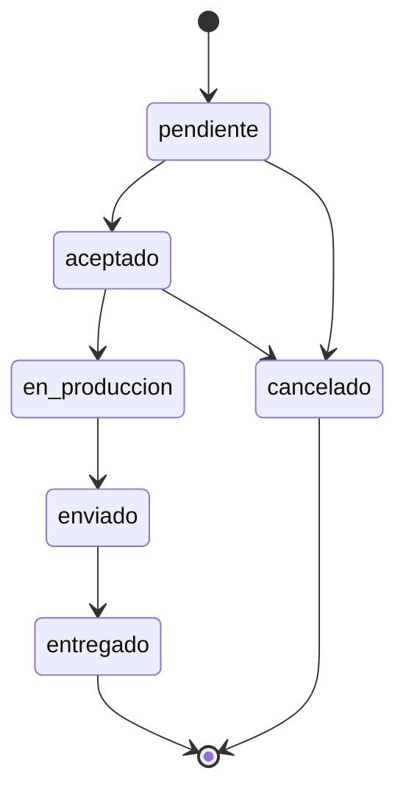

# StudioSeptiembre

Aplicación web **editorial** para una marca de cerámica artesanal de Madrid. No es una
tienda online tradicional: es una experiencia inmersiva donde el cliente **solicita**
piezas (sin carrito). Estética de lujo silencioso inspirada en Frama, Aesop, Ferm Living
y Zara Home Studio.

La app tiene dos partes:

- **Parte pública** (editorial): Home, Catálogo, Producto, Colecciones, Sobre nosotras,
  Contacto y Formulario de pedido. Los formularios de contacto y pedido **persisten en
  Supabase** a través de rutas de servidor.
- **Parte privada** (panel de administración, `/panel`, protegido con Supabase Auth):
  dashboard, gestión de **productos** y **colecciones** (alta/edición + subida de fotos +
  publicar/destacar/eliminar) y listados de pedidos y clientes.

Los productos se dividen en dos categorías:

1. **Hechos bajo pedido** (`made_to_order`) → muestran tiempo de producción.
2. **Colecciones de envío inmediato** (`in_stock`) → muestran stock; la colección se oculta
   automáticamente al agotarse.

---

## Stack tecnológico

| Capa | Tecnología | Versión |
|---|---|---|
| Meta-framework | **Nuxt 3** (Vue 3 + Vite + Nitro) | `^3.13.2` |
| UI | **Vue 3** `<script setup>` + TypeScript | `^3.5.12` |
| Estilos | **TailwindCSS** (`@nuxtjs/tailwindcss`) | `^6.12.2` |
| Estado | **Pinia** (`@pinia/nuxt`) | `^2.2.4` |
| Imágenes | **@nuxt/image** | `^1.8.1` |
| Fuentes | **@nuxtjs/google-fonts** (Fraunces + Inter) | `^3.2.0` |
| Tipos | **TypeScript** (modo strict) + `vue-tsc` | `^5.6.3` |
| Backend | **Supabase** (Postgres + Auth + Storage) vía `@nuxtjs/supabase` | `^2.0.9` |

Requisitos: **Node.js 20+** y npm. Se necesita un archivo `.env` con las claves de
Supabase (ver _Configuración de Supabase_).

---

## Puesta en marcha

```bash
npm install          # instala dependencias (ejecuta `nuxt prepare` en postinstall)
npm run dev          # servidor de desarrollo en http://localhost:3000
```

### Scripts disponibles

| Script | Acción |
|---|---|
| `npm run dev` | Servidor de desarrollo con HMR |
| `npm run build` | Build de producción (genera `.output/`) |
| `npm run preview` | Previsualiza el build de producción localmente |
| `npm run generate` | Generación estática (SSG) |
| `npm run typecheck` | Comprobación de tipos con `vue-tsc` |

> Importante: no arranques `npm run dev` en varias terminales a la vez. Si necesitas
> reiniciarlo, haz `Ctrl + C` en su terminal y vuelve a lanzarlo ahí mismo. Tener varios
> dev servers en paralelo provoca errores de _hydration mismatch_ y `404` de manifiesto.

---

## Estructura del proyecto

```
studiosep/
├─ app.vue                  # raíz: <NuxtLayout> + <NuxtPage>
├─ error.vue                # página de error
├─ nuxt.config.ts           # configuración (módulos, supabase, fuentes, routeRules)
├─ tailwind.config.ts       # tokens de diseño (colores, tipografías, easing)
├─ assets/css/              # CSS global (clases utilitarias: container-editorial, eyebrow…)
├─ components/
│  ├─ SiteHeader.vue        # cabecera / navegación
│  ├─ SiteFooter.vue        # pie
│  ├─ editorial/            # HeroSection, EditorialBlock (bloques de marketing)
│  ├─ product/              # ProductCard (distingue bajo pedido / colección)
│  └─ panel/                # ProductForm, CollectionForm (formularios de administración)
├─ composables/
│  ├─ useCatalog.ts         # CONSULTAS públicas a Supabase (productos, colecciones)
│  ├─ useProductAdmin.ts    # ESCRITURA de productos (CRUD, variantes, dimensiones, fotos)
│  └─ useCollectionAdmin.ts # ESCRITURA de colecciones (CRUD + portada)
├─ layouts/
│  ├─ default.vue           # layout público (editorial)
│  └─ studio.vue            # layout del panel privado (sidebar + sesión)
├─ pages/                   # rutas (file-based routing)
│  ├─ index.vue             # /            Home
│  ├─ catalogo/index.vue    # /catalogo    Catálogo (toggle bajo pedido / stock)
│  ├─ catalogo/[slug].vue   # /catalogo/:slug  Página de producto
│  ├─ colecciones/index.vue # /colecciones
│  ├─ colecciones/[slug].vue
│  ├─ sobre-nosotras.vue    # /sobre-nosotras
│  ├─ contacto.vue          # /contacto   (envía a /api/inquiry)
│  ├─ pedido/index.vue      # /pedido      Formulario de solicitud (envía a /api/order)
│  ├─ pedido/gracias.vue    # /pedido/gracias
│  └─ panel/                # PANEL PRIVADO (protegido con Supabase Auth)
│     ├─ login.vue          # /panel/login
│     ├─ confirm.vue        # /panel/confirm   (callback de auth)
│     ├─ index.vue          # /panel           dashboard
│     ├─ pedidos.vue        # /panel/pedidos   (lista)
│     ├─ clientes.vue       # /panel/clientes  (lista)
│     ├─ ajustes.vue        # /panel/ajustes
│     ├─ productos/         # index · nuevo · [id]  (CRUD + fotos)
│     └─ colecciones/       # index · nuevo · [id]  (CRUD + portada)
├─ server/api/
│  ├─ inquiry.post.ts       # alta pública del formulario de contacto (service_role)
│  └─ order.post.ts         # alta pública del formulario de pedido (service_role)
├─ supabase/
│  ├─ schema.sql            # tablas + RLS + bucket de Storage
│  └─ seed.sql              # datos de ejemplo (colección + 4 productos)
├─ lib/
│  ├─ data.ts               # datos mock (legado; las páginas ya usan Supabase)
│  └─ format.ts             # utilidades (formato de precio, tiempo de producción)
├─ types/index.ts           # tipos de dominio (Product, Collection, estados, variantes)
└─ public/                  # estáticos (favicon, imágenes propias)
```

### Notas de configuración (`nuxt.config.ts`)

- **`components: [{ path: '~/components', pathPrefix: false }]`** → los componentes se
  auto-importan por nombre de archivo (`<HeroSection>`, no `<EditorialHeroSection>`).
- **`googleFonts: { download: false }`** → no descarga las fuentes en build (la red
  corporativa con proxy TLS lo bloqueaba). Se cargan por `<link>` y, si fallan, caen al
  stack de respaldo definido en Tailwind (Georgia/serif, system-ui).
- **`supabase.redirectOptions`** → protege **solo** `/panel/**`; el resto del sitio es
  público. Redirige a `/panel/login` si no hay sesión (excepto `login` y `confirm`).
- **`routeRules`** → render híbrido: `/` y páginas casi estáticas con SWR; **catálogo y
  colecciones en SSR fresco** (sin SWR) para que las ediciones del panel aparezcan al
  instante; `/panel/**` siempre SSR sin indexar.

---

## Diagramas de arquitectura

### Visión general



### Navegacion (parte publica)



### Modelo de datos (relaciones)



### Flujo de un pedido (estados)



---

## Modelo de datos

Definido en [`types/index.ts`](./types/index.ts). Entidades principales:

- **`Product`**: `availabilityType` (`made_to_order` | `in_stock`), `priceCents`,
  `productionTimeDays`, `stockQuantity`, `images`, `dimensions`, `materials`, `variants`,
  `isFeatured`, `isPublished`.
- **`ProductVariant`**: `type` (`color` | `tamaño` | `acabado`), `label`, `priceDeltaCents`,
  `stockQuantity`.
- **`Collection`**: `slug`, `title`, `month`, `coverImage`, `isPublished`.

**Estados de un pedido** (`ProductionStatus`):

```
pendiente → aceptado → en_produccion → enviado → entregado
(cancelado como estado final aparte)
```

> Los precios se guardan en **céntimos** (`priceCents`). 95 € = `9500`.

---

## Gestión de contenido (fotos y datos de producto)

Todo el contenido vive en **Supabase**, que tiene dos partes:

1. **Base de datos** (Postgres): tablas `products`, `collections`, `product_images`,
   `product_variants`, `product_dimensions`… → los datos (nombre, precio, descripción,
   stock, disponibilidad…).
2. **Storage** (bucket `products`): los **archivos de las fotos**.

### Flujo: del panel a la web del cliente

```
Admin (las ceramistas)  →  Supabase  →  Web pública (clientes)
                           ├ Tablas (Postgres)
                           └ Storage (bucket "products")
```

La web pública **no muestra todo**: solo lee las filas marcadas como **publicadas**. Esto lo
resuelve la capa de consulta en [`composables/useCatalog.ts`](./composables/useCatalog.ts):

- `is_published = true` → visible para clientes.
- `is_published = false` → borrador, invisible en la web.

Así se puede preparar una pieza en borrador y publicarla cuando se quiera.

### Cómo funcionan las fotos

La columna `product_images.storage_path` admite **dos formatos** y `resolveImageUrl()` (en
`useCatalog.ts`) los distingue automáticamente:

- **URL completa** (`https://…`) → se usa tal cual. Es lo que hace [`seed.sql`](./supabase/seed.sql)
  con los placeholders de `picsum.photos`.
- **Ruta dentro del bucket** (p. ej. `jarron-alba/01.jpg`) → se convierte en URL pública del
  bucket `products`. Es lo que se guardará al subir **fotos reales**.

Por eso conviven datos de demo y fotos reales sin tocar código.

### El panel de administración (`/panel`)

Protegido con **Supabase Auth** (email + contraseña). Layout propio con barra lateral
([`layouts/studio.vue`](./layouts/studio.vue)). Secciones:

| Sección | Ruta | Estado |
|---|---|---|
| Dashboard (métricas + pedidos recientes) | `/panel` | ✅ |
| **Productos** (alta/edición, fotos, variantes, dimensiones, publicar/destacar/eliminar) | `/panel/productos` | ✅ CRUD completo |
| **Colecciones** (alta/edición, portada, aviso de visibilidad) | `/panel/colecciones` | ✅ CRUD completo |
| Pedidos | `/panel/pedidos` | 🟡 solo lista (sin cambio de estado) |
| Clientes | `/panel/clientes` | 🟡 solo lista |
| Ajustes | `/panel/ajustes` | ✅ sesión / info |

**Flujo de fotos**: al crear una pieza se guarda primero (para obtener su `id`) y luego se
habilita la subida de imágenes al bucket. La escritura vive en
[`useProductAdmin.ts`](./composables/useProductAdmin.ts) y
[`useCollectionAdmin.ts`](./composables/useCollectionAdmin.ts).

**Visibilidad de una colección en la web**: debe estar **publicada** Y tener **≥ 1 producto
publicado** asignado. El formulario de colección avisa de los requisitos que falten.

### Formularios públicos (contacto y pedido)

Las tablas `inquiries`, `orders` y `customers` **no permiten escritura pública** por RLS.
Las altas desde la web pasan por **rutas de servidor** que usan la `service_role` key
(omite RLS) y validan la entrada:

| Formulario | Página | Endpoint | Qué hace |
|---|---|---|---|
| Contacto | `/contacto` | [`/api/inquiry`](./server/api/inquiry.post.ts) | inserta en `inquiries` |
| Pedido | `/pedido` | [`/api/order`](./server/api/order.post.ts) | crea/reutiliza `customer`, crea `order` + `order_item` |

El precio y el tipo de pedido se leen de la BD (nunca se confía en el cliente). Una
solicitud aparece luego en el panel (Pedidos / Clientes / contador de Consultas).

> En la **red corporativa** los formularios y el SSR no funcionan en local (el proxy TLS
> bloquea las llamadas del servidor a Supabase); en **Vercel** sí.

---

## Configuración de Supabase

1. Crea un proyecto en [supabase.com](https://supabase.com) y copia las claves.
2. Crea un archivo `.env` en la raíz (no se sube a git):

   ```env
   SUPABASE_URL=https://<tu-ref>.supabase.co
   SUPABASE_KEY=<anon / publishable key>
   SUPABASE_SERVICE_KEY=<service_role / secret key>
   ```

3. En el **SQL Editor** de Supabase ejecuta, en este orden:
   - [`supabase/schema.sql`](./supabase/schema.sql) → tablas, RLS y bucket `products`.
   - [`supabase/seed.sql`](./supabase/seed.sql) → datos de ejemplo (opcional).
4. **Auth** → crea el usuario administrador (email + contraseña) y, para producción,
   añade el dominio de Vercel en _Auth → URL Configuration_.
5. Verifica que el bucket `products` es **público** (lectura).

> ⚠ **La `service_role` key es secreta**: solo en `.env` y en las variables de entorno de
> Vercel. Nunca en el código ni en el repositorio. Si se expone, rótala en Supabase.

---

## Tokens de diseño

Definidos en [`tailwind.config.ts`](./tailwind.config.ts):

- **Colores**: `clay #B9A18B`, `bone #F4EFE6`, `stone #D9D2C7`, `ink #2B2622`,
  `engobe #8C7A66`, `accent #6E4A34`.
- **Tipografías**: serif `Fraunces` (titulares), sans `Inter` (cuerpo).
- **Easing editorial**: `cubic-bezier(0.16, 1, 0.3, 1)` (`ease-editorial`).
- **`tracking-widest2`**: `0.2em` para los _eyebrows_ en mayúsculas.

---

## Despliegue

El proyecto se despliega en **Vercel** (detecta Nuxt automáticamente):

1. Importar el repo `andreagro17/studiosep` en https://vercel.com.
2. **Variables de entorno** (Settings → Environment Variables, para Production):
   `SUPABASE_URL`, `SUPABASE_KEY` y `SUPABASE_SERVICE_KEY`. Sin la `service_role` los
   formularios públicos fallan.
3. Vercel usa `npm run build` y sirve `.output/` sin configuración extra.
4. La web de producción se publica desde la rama por defecto; cada push redespliega.
5. En Supabase, añade el dominio de Vercel en _Auth → URL Configuration_ para que el
   login del panel funcione en producción.

> El aviso `sharp binaries for win32-x64 cannot be found` en build local es **inofensivo**:
> en Vercel (Linux) `sharp` se instala correctamente.

---

## Roadmap (siguientes pasos)

Hecho:

- [x] Conectar **Supabase**: esquema SQL, RLS, Storage y capa de consultas/escritura.
- [x] **Panel privado** con Supabase Auth: dashboard, productos (CRUD + variantes +
      dimensiones + fotos + destacar/publicar), colecciones (CRUD + portada).
- [x] Páginas públicas servidas desde Supabase (sustituido `lib/data.ts`).
- [x] Server routes (`server/api`) para pedido y contacto con `service_role`.

Pendiente:

- [ ] **Pedidos en el panel**: detalle y **cambio de estado de producción** (las 10 fases).
- [ ] **Clientes**: ficha e historial de pedidos.
- [ ] Validación con **Zod** en los `server/api` y notificación por email de nuevas altas.
- [ ] Componentes de producto: `VariantSelector`, `ProductGallery`.
- [ ] Pulido: animaciones de scroll, accesibilidad (AA), SEO/OG, auto-alojado de fuentes.
- [ ] Retirar `lib/data.ts` (legado) cuando ya no sirva de referencia.

---

## Notas para quien continúe el proyecto

- **Marca**: el nombre interno del paquete es `studioseptiembre`.
- **Idioma**: la UI y el contenido están en español (`htmlAttrs.lang = 'es'`).
- **Red corporativa**: si desarrollas detrás de un proxy con certificado autofirmado,
  la descarga de fuentes/recursos externos puede fallar; por eso `download: false`.
- **No subir a git**: `node_modules/`, `.nuxt/`, `.output/`, `.env*` (ya cubiertos en
  `.gitignore`). Nunca incluyas tokens ni credenciales en comandos o en el repo.
