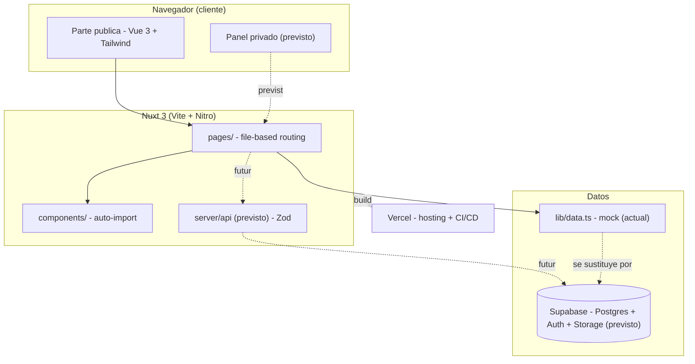
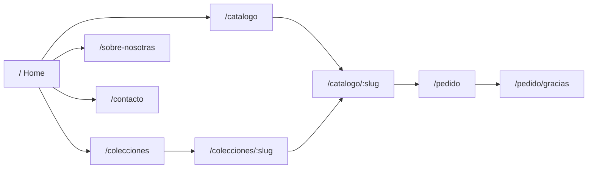
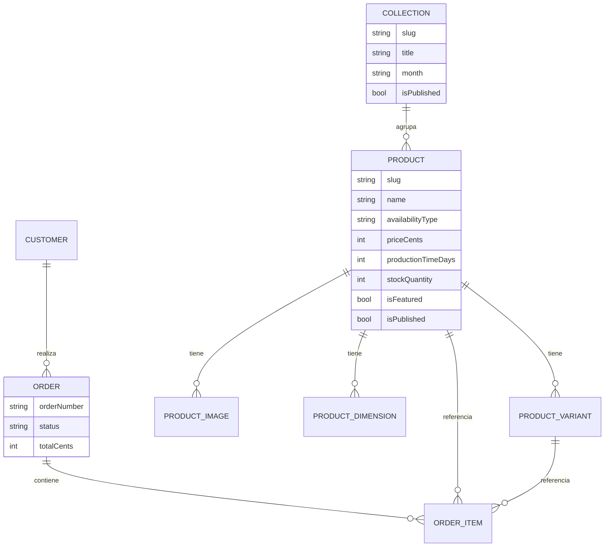
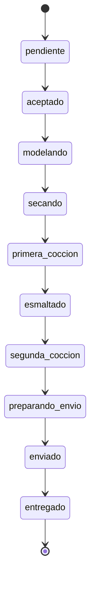

# StudioSeptiembre

Aplicación web **editorial** para una marca de cerámica artesanal de Madrid. No es una
tienda online tradicional: es una experiencia inmersiva donde el cliente **solicita**
piezas (sin carrito). Estética de lujo silencioso inspirada en Frama, Aesop, Ferm Living
y Zara Home Studio.

La app tiene dos partes:

- **Parte pública** (editorial): Home, Catálogo, Producto, Colecciones, Sobre nosotras,
  Contacto y Formulario de pedido.
- **Parte privada** (panel de administración, _pendiente de construir_): dashboard, gestión
  de pedidos/productos/clientes/colecciones y subida de imágenes.

Los productos se dividen en dos categorías:

1. **Hechos bajo pedido** (`made_to_order`) → muestran tiempo de producción.
2. **Colecciones de envío inmediato** (`in_stock`) → muestran stock; la colección se oculta
   automáticamente al agotarse.

---

## Stack tecnológico

| Capa | Tecnología | Versión |
|---|---|---|
| Meta-framework | **Nuxt 3** (Vue 3 + Vite + Nitro) | `^3.13.2` |
| UI | **Vue 3** `<script setup>` + TypeScript | `^3.5.12` |
| Estilos | **TailwindCSS** (`@nuxtjs/tailwindcss`) | `^6.12.2` |
| Estado | **Pinia** (`@pinia/nuxt`) | `^2.2.4` |
| Imágenes | **@nuxt/image** | `^1.8.1` |
| Fuentes | **@nuxtjs/google-fonts** (Fraunces + Inter) | `^3.2.0` |
| Tipos | **TypeScript** (modo strict) + `vue-tsc` | `^5.6.3` |
| Backend (previsto) | **Supabase** (Postgres + Auth + Storage) | _pendiente_ |

Requisitos: **Node.js 20+** y npm.

---

## Puesta en marcha

```bash
npm install          # instala dependencias (ejecuta `nuxt prepare` en postinstall)
npm run dev          # servidor de desarrollo en http://localhost:3000
```

### Scripts disponibles

| Script | Acción |
|---|---|
| `npm run dev` | Servidor de desarrollo con HMR |
| `npm run build` | Build de producción (genera `.output/`) |
| `npm run preview` | Previsualiza el build de producción localmente |
| `npm run generate` | Generación estática (SSG) |
| `npm run typecheck` | Comprobación de tipos con `vue-tsc` |

> Importante: no arranques `npm run dev` en varias terminales a la vez. Si necesitas
> reiniciarlo, haz `Ctrl + C` en su terminal y vuelve a lanzarlo ahí mismo. Tener varios
> dev servers en paralelo provoca errores de _hydration mismatch_ y `404` de manifiesto.

---

## Estructura del proyecto

```
studiosep/
├─ app.vue                  # raíz: <NuxtLayout> + <NuxtPage>
├─ error.vue                # página de error
├─ nuxt.config.ts           # configuración (módulos, fuentes, routeRules, components)
├─ tailwind.config.ts       # tokens de diseño (colores, tipografías, easing)
├─ assets/css/              # CSS global (clases utilitarias: container-editorial, eyebrow…)
├─ components/
│  ├─ SiteHeader.vue        # cabecera / navegación
│  ├─ SiteFooter.vue        # pie
│  ├─ editorial/            # HeroSection, EditorialBlock (bloques de marketing)
│  └─ product/              # ProductCard (distingue bajo pedido / colección)
├─ layouts/
│  ├─ default.vue           # layout público (editorial)
│  └─ studio.vue            # layout del panel privado (pendiente de uso)
├─ pages/                   # rutas (file-based routing)
│  ├─ index.vue             # /            Home
│  ├─ catalogo/index.vue    # /catalogo    Catálogo (toggle bajo pedido / stock)
│  ├─ catalogo/[slug].vue   # /catalogo/:slug  Página de producto
│  ├─ colecciones/index.vue # /colecciones
│  ├─ colecciones/[slug].vue
│  ├─ sobre-nosotras.vue    # /sobre-nosotras
│  ├─ contacto.vue          # /contacto
│  ├─ pedido/index.vue      # /pedido      Formulario de solicitud
│  └─ pedido/gracias.vue    # /pedido/gracias
├─ lib/
│  ├─ data.ts               # DATOS DE EJEMPLO (mock). Se sustituirá por Supabase
│  └─ format.ts             # utilidades (formato de precio, tiempo de producción)
├─ types/index.ts           # tipos de dominio (Product, Collection, estados, variantes)
└─ public/                  # estáticos (favicon, imágenes propias)
```

### Notas de configuración (`nuxt.config.ts`)

- **`components: [{ path: '~/components', pathPrefix: false }]`** → los componentes se
  auto-importan por nombre de archivo (`<HeroSection>`, no `<EditorialHeroSection>`).
- **`googleFonts: { download: false }`** → no descarga las fuentes en build (la red
  corporativa con proxy TLS lo bloqueaba). Se cargan por `<link>` y, si fallan, caen al
  stack de respaldo definido en Tailwind (Georgia/serif, system-ui).
- **`routeRules`** → render híbrido: home/sobre-nosotras prerenderizadas, catálogo/
  colecciones con SWR, y `/panel/**` siempre SSR sin cache.

---

## Diagramas de arquitectura

### Visión general



### Navegacion (parte publica)



### Modelo de datos (relaciones)



### Flujo de un pedido (estados de produccion)



---

## Modelo de datos

Definido en [`types/index.ts`](./types/index.ts). Entidades principales:

- **`Product`**: `availabilityType` (`made_to_order` | `in_stock`), `priceCents`,
  `productionTimeDays`, `stockQuantity`, `images`, `dimensions`, `materials`, `variants`,
  `isFeatured`, `isPublished`.
- **`ProductVariant`**: `type` (`color` | `tamaño` | `acabado`), `label`, `priceDeltaCents`,
  `stockQuantity`.
- **`Collection`**: `slug`, `title`, `month`, `coverImage`, `isPublished`.

**Estados de producción de un pedido** (`ProductionStatus`, 10 fases artesanales):

```
pendiente → aceptado → modelando → secando → primera_coccion
→ esmaltado → segunda_coccion → preparando_envio → enviado → entregado
```

> Los precios se guardan en **céntimos** (`priceCents`). 95 € = `9500`.

---

## Gestión de contenido (fotos y datos de producto)

Actualmente el contenido es **mock** y vive en [`lib/data.ts`](./lib/data.ts); las imágenes
son de `picsum.photos`. Para cargar material real **antes de tener el panel**:

1. Coloca las fotos en `public/images/` → se referencian como `/images/mi-foto.jpg`.
2. Edita los objetos de `lib/data.ts` (nombre, descripción, `priceCents`, dimensiones,
   materiales, variantes…).

La forma definitiva será el **panel privado + Supabase**, donde el contenido se gestiona
desde una interfaz sin tocar código (ver _Roadmap_).

---

## Tokens de diseño

Definidos en [`tailwind.config.ts`](./tailwind.config.ts):

- **Colores**: `clay #B9A18B`, `bone #F4EFE6`, `stone #D9D2C7`, `ink #2B2622`,
  `engobe #8C7A66`, `accent #6E4A34`.
- **Tipografías**: serif `Fraunces` (titulares), sans `Inter` (cuerpo).
- **Easing editorial**: `cubic-bezier(0.16, 1, 0.3, 1)` (`ease-editorial`).
- **`tracking-widest2`**: `0.2em` para los _eyebrows_ en mayúsculas.

---

## Despliegue

El proyecto se despliega en **Vercel** (detecta Nuxt automáticamente):

1. Importar el repo `andreagro17/studiosep` en https://vercel.com.
2. Vercel usa `npm run build` y sirve `.output/` sin configuración extra.
3. La web de producción se publica desde la rama por defecto (`main`); cada push
   redespliega automáticamente.

> El aviso `sharp binaries for win32-x64 cannot be found` en build local es **inofensivo**:
> en Vercel (Linux) `sharp` se instala correctamente.

---

## Roadmap (siguientes pasos)

- [ ] Conectar **Supabase**: esquema SQL, RLS, Storage y generación de tipos.
- [ ] **Panel privado** con autenticación: dashboard, pedidos (cambio de estados),
      productos (CRUD + variantes + destacar/ocultar), clientes, colecciones y subida de fotos.
- [ ] Sustituir `lib/data.ts` por consultas reales a Supabase.
- [ ] Server routes (`server/api`) para solicitudes de pedido y contacto, validadas con Zod.
- [ ] Componentes pendientes: `VariantSelector`, `ProductGallery`, `OrderRequestForm`.
- [ ] Pulido: animaciones de scroll, accesibilidad (AA), SEO/OG, auto-alojado de fuentes.

---

## Notas para quien continúe el proyecto

- **Marca**: el nombre interno del paquete es `studioseptiembre`.
- **Idioma**: la UI y el contenido están en español (`htmlAttrs.lang = 'es'`).
- **Red corporativa**: si desarrollas detrás de un proxy con certificado autofirmado,
  la descarga de fuentes/recursos externos puede fallar; por eso `download: false`.
- **No subir a git**: `node_modules/`, `.nuxt/`, `.output/`, `.env*` (ya cubiertos en
  `.gitignore`). Nunca incluyas tokens ni credenciales en comandos o en el repo.
